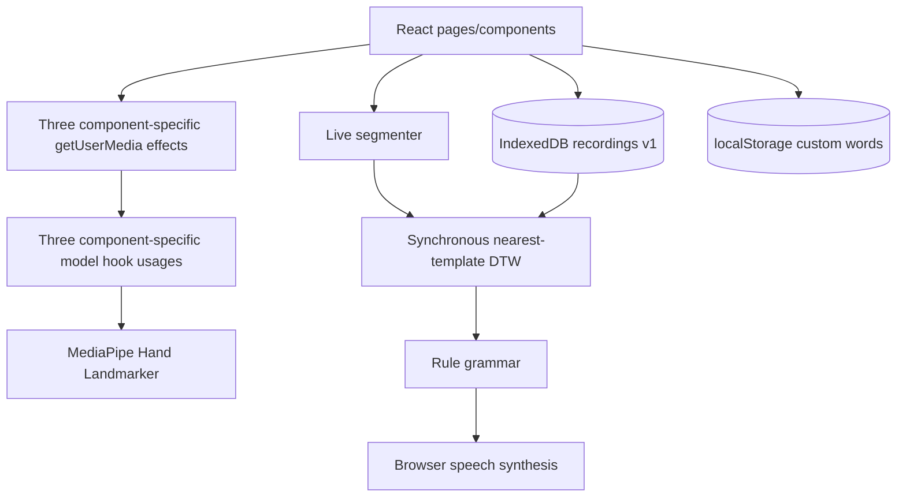

# Technical Architecture, Data, Privacy, and Security Requirements

| Field | Value |
|---|---|
| Document | Target engineering and trust-boundary requirements |
| Status | Proposed |
| Version | 1.0 |
| Baseline | 2026-09-25 |
| Engineering owner | Assign before approval |
| Privacy/security owner | Assign before approval |
| QA owner | Assign before approval |
| Related documents | `01-master-product-requirements.md`, `02-functional-requirements.md`, `03-ux-accessibility-requirements.md`, `07-verification-release-roadmap.md` |

## 1. Purpose

This document defines the target implementation boundary, data contracts, browser resource model, security/privacy posture, performance requirements, deployment assumptions, and migration path needed to turn the current prototype into a releasable product.

It does not select a backend, cloud service, authentication provider, or machine-learning vendor. Those are not required for the proposed local-first beta and require separate decisions if introduced.

## 2. Evidence labels

- **Current** — present in source/runtime evidence.
- **Target** — required architecture/behavior.
- **Placeholder** — owner must approve a value, platform, or policy.
- **Deferred** — intentionally outside this release.

## 3. Current architecture assessment

### 3.1 Current shape



### 3.2 Current strengths

- Static client-only deployment is simple and has no remote/server account or database attack surface; local-storage, import, and same-origin script attack surfaces remain.
- The processing pipeline is separated into understandable modules.
- Recording stores landmarks rather than raw audio/video.
- Local-first operation limits first-party data transfer.
- Existing hand-count metadata, recorder, and condition fields provide a basis for quality evaluation.

### 3.3 Current architectural blockers

1. Camera/model lifecycle logic is duplicated and not safely cancelable.
2. React Strict Mode can expose uncancelled camera/model creation.
3. Recognition runs synchronously on the camera/main thread.
4. Recordings, custom metadata, and exports have incompatible/unversioned schemas.
5. Import is not transactional and validates almost no nested data.
6. Data and template rebuild operations are not coordinated.
7. Live segmentation and pseudo-confidence have no versioned quality policy.
8. There is no error boundary, observability layer, test seam, or supported-platform adapter.
9. Root-host assumptions, remote assets, and SPA fallback are not deployment contracts.
10. The current production bundle contains very large Spline chunks and runs a 3D scene alongside camera work.

## 4. Target architecture principles

1. **Single session owner.** Camera, model, frame loop, overlay, and adaptive quality have one lifecycle controller.
2. **Typed boundaries.** Browser/media, storage, recognition, language, and UI communicate through explicit versioned contracts.
3. **Raw data minimization.** Raw pixels/audio are transient and are not persisted. Persist only approved landmark/timing/provenance data.
4. **Commit before publish.** UI counts/template indexes update only after durable storage completion.
5. **Versioned policy and data.** Vocabulary, recording, export, segmentation, normalization, and recognizer versions are explicit.
6. **Quality before use.** Structurally invalid or policy-excluded templates never enter the live library.
7. **Abstain safely.** Ambiguous/unknown input is a first-class outcome.
8. **No decorative dependency on core function.** Remote 3D, fonts, and model assets have fallbacks and do not own text/actions.
9. **Privacy-safe diagnostics by default.** Logs/metrics exclude raw frames, landmarks, labels, and recorder names.
10. **Static-first release.** Keep the beta client-side unless a separately approved feature requires a server.

## 5. Target logical components

```mermaid
flowchart LR
    Router[Router + lazy pages]
    Router --> Onboard[Onboarding / capability gate]
    Router --> Interpret[Interpret UI]
    Router --> Record[Record UI]
    Router --> Review[Review UI]
    Router --> Diagnostics[Diagnostics UI]

    Onboard --> Session[HandSessionController]
    Interpret --> Session
    Record --> Session
    Diagnostics --> Session

    Session --> Camera[CameraAdapter]
    Session --> Tracker[HandTrackingAdapter]
    Session --> Quality[AdaptiveQualityController]
    Session --> Overlay[LandmarkOverlay]

    Record --> Capture[CaptureController]
    Capture --> Validator[RecordingValidator]
    Validator --> Normalizer[Normalizer]
    Normalizer --> RecorderRepo[(RecordingRepository)]

    Interpret --> Segmenter[TimestampedSegmenter]
    Segmenter --> LiveValidator[SegmentQualityValidator]
    LiveValidator --> Recognizer[RecognitionEngine (Worker if selected)]
    RecorderRepo --> Library[TemplateLibraryBuilder]
    VocabRepo[(VocabularyRepository)] --> Library
    Library --> Recognizer
    Recognizer --> Outcome[TypedRecognitionOutcome]
    Outcome --> Transcript[TranscriptController]
    Transcript --> Grammar[PhraseExpansion]
    Grammar --> Speech[SpeechAdapter]

    RecorderRepo <--> Transfer[ImportExportService]
    VocabRepo <--> Transfer
    Review --> RecorderRepo
    Review --> VocabRepo
    Session -. privacy-safe metrics .-> Telemetry[LocalDiagnostics]
```

### 5.1 Component responsibilities

| Component | Responsibility | Must not own |
|---|---|---|
| `HandSessionController` | Permission, camera/model lifecycle, one frame loop, track-ended/visibility handling, session state | Vocabulary, speech, React page layout |
| `CameraAdapter` | `getUserMedia`, negotiated constraints, mirror/crop, track events, explicit stop | MediaPipe creation or React state |
| `HandTrackingAdapter` | MediaPipe initialization, delegate policy, detection, model close | Page-specific UI or recording labels |
| `AdaptiveQualityController` | Frame cadence, dropped frames, approved processing-scale changes, recovery | Arbitrary unvalidated thresholds |
| `CaptureController` | Countdown/capture/cancel/watchdog, Start-time vocabulary/metadata snapshot, capture start/end timestamps | Final persistence/validation policy |
| `RecordingValidator` | Structural and quality checks, warnings, eligibility | UI copy/storage transactions |
| `RecordingRepository` | IndexedDB lifecycle, transactions, migrations, queries, deletion | React rendering/DTW |
| `VocabularyRepository` | Built-in/custom schema, stable IDs, labels, migration, synchronization | Frame capture |
| `TemplateLibraryBuilder` | Eligible templates, class summaries, quality weights, rebuild/version | Camera or speech |
| `TimestampedSegmenter` | Segment boundaries and quality/interruption metadata | Speech or final acceptance threshold |
| `RecognitionEngine` | Cancellable/versioned DTW or approved classifier; a Worker is an implementation option when required by the performance budget | DOM/camera/storage |
| `TranscriptController` | Ordered recognized/manual entries, edit/remove, completion trigger, history policy | Direct Speech API side effects in state updaters |
| `PhraseExpansion` | Versioned deterministic rules using approved spoken text | Recognition/storage/browser APIs |
| `SpeechAdapter` | Feature detection, language/voice, queue/cancel/error events | Transcript source of truth |
| `ImportExportService` | Package validation, limits, atomic/staged import, complete export | Direct UI state |
| `LocalDiagnostics` | Capability/performance/error metrics, redacted support package | Raw gesture/user content |

## 6. Browser/platform contract

### 6.1 Required capabilities

| Capability | Requirement | Fallback |
|---|---|---|
| Secure context + camera | Required for live/record | Explain HTTPS/localhost requirement; text/data management may remain available |
| MediaPipe WASM/model | Required for tracking | Static experience and clear failure/retry; no fake ready state |
| IndexedDB | Required for recordings/templates | Export-only/manual recovery path if possible; no false save |
| Canvas | Required for visual overlay/replay | Text transcript/metadata still available for stored data |
| File/Blob | Required for import/export | Disable with explanation |
| Speech Synthesis | Optional | Persistent text transcript, manual copy/replay unavailable if no alternate output |
| `requestVideoFrameCallback` | Optional optimization | RAF fallback with timestamp contract |
| Network | Depends on approved asset strategy | Bundled/local/static fallback where required |

### 6.2 Supported matrix

The following fields require approval before release:

| Field | Required decision |
|---|---|
| Desktop browsers | Exact versions and minimum versions |
| Mobile browsers | In/out of scope; camera/WASM/background constraints |
| Operating systems | Windows/macOS/Linux/iOS/Android versions |
| GPU/CPU classes | Minimum and representative high/low performance |
| Camera environments | Built-in/external, front/rear, common resolutions |
| Secure context | HTTPS requirements and localhost development policy |
| Screen/viewport | Minimum supported width, zoom/reflow target |
| Speech | Supported voices/languages and platform fallback |
| Storage | Expected dataset size and quota assumptions |

**Target:** Product behavior shall degrade explicitly rather than fail silently outside the supported matrix.

## 7. Frame and landmark contracts

### 7.1 Live/capture frame

```ts
type Landmark = {
  x: number
  y: number
  z: number
  visibility?: number
}

type TrackedHand = {
  landmarks: Landmark[] // exactly 21 in production
  handedness?: "Left" | "Right" | "Unknown"
  handednessScore?: number
}

type TrackedFrame = {
  frameId: string
  timestampMs: number       // monotonic elapsed time
  wallClockMs?: number      // only if needed; not required for DTW
  hands: TrackedHand[]
  detectionDurationMs?: number
  processingScale?: number
}
```

### 7.2 Frame contract requirements

- Coordinates shall be finite numbers.
- Production hand arrays shall contain exactly 21 landmarks.
- Frame order shall be deterministic and gaps explicit.
- Actual timestamps shall drive timing.
- Handedness is optional and must not be assumed from array order.
- Raw image/video frames shall not enter persistence, diagnostics, or recognition-engine messages.
- Coordinate aspect-ratio and normalization policy shall be versioned and evaluated across devices.

## 8. Target data model

The following is a proposed logical schema. Field-level implementation may differ only if it preserves equivalent semantics, validation, migration, and privacy.

### 8.1 Vocabulary entry

```ts
type VocabularyStatus = "active" | "draft" | "deprecated" | "quarantined"

type VocabularyEntry = {
  schemaVersion: number
  id: string                    // globally unique, stable; e.g. builtin:help or custom:uuid
  label: string                 // display text
  spokenText?: string           // approved pronunciation/output
  category: string
  expectedHands: 1 | 2 | "variable"
  semanticStatus?: "approved" | "ambiguous" | "restricted"
  source: "builtin" | "custom" | "imported"
  status: VocabularyStatus
  version: number
  approvedAt?: string
  notes?: string
}
```

**Requirements:**

- Built-in and custom IDs share one namespace and cannot collide.
- Editing a label does not change the stable ID.
- Ambiguous/restricted semantics cannot silently become normal text output.
- Built-in vocabulary changes are versioned and migration tested.

### 8.2 Recording

```ts
type QualityState = "approved" | "review" | "rejected" | "quarantined"

type Recording = {
  schemaVersion: number
  id: string
  vocabularyId: string
  labelAtCapture: string
  vocabularyVersion: number
  captureStartedAt: string        // ISO timestamp bound when capture begins
  captureEndedAt: string          // ISO timestamp bound when capture finishes
  recordedAt: string              // ISO persistence timestamp; not a substitute for capture timing
  recordedBy?: string             // user-entered; sensitive free text
  conditionLabel?: string
  expectedHands: 1 | 2 | "variable"
  observedHands: {
    majority: 0 | 1 | 2
    validFrameRatio: number
    distribution: Record<number, number>
  }
  frames: Array<{
    timestampMs: number
    hands: TrackedHand[]
  }>
  durationMs: number
  capture: {
    source: "camera" | "import"
    modelVersion?: string
    camera?: {
      width?: number
      height?: number
      frameRate?: number
      facingMode?: string
    }
  }
  normalization: {
    version: number
  }
  quality: {
    state: QualityState
    score?: number
    warnings: string[]
    metrics?: Record<string, number>
  }
  provenance: {
    importSource?: string
    contentHash?: string
  }
}
```

**Privacy constraints:**

- Do not store camera device IDs, raw pixels, audio, or full browser fingerprints.
- Recorder and condition labels are optional and treated as user-entered content.
- Content hashes must not include unrelated local metadata.
- Imported provenance must not silently expose local filesystem paths.

### 8.3 Template class

```ts
type TemplateClass = {
  vocabularyId: string
  templates: Recording[]
  qualitySummary: {
    approvedCount: number
    reviewCount: number
    rejectedCount: number
    readyState: "empty" | "collecting" | "ready" | "needs-review"
  }
  policyVersion: string
}
```

Raw recording count shall not define `readyState`. Readiness shall use approved quality rules and, where claimed, evaluation evidence.

### 8.4 Segment

```ts
type SegmentQuality = {
  state: "valid" | "merged-risk" | "truncated-risk" | "dropout" | "invalid"
  warnings: string[]
  observedHands: number
  validFrameRatio: number
  durationMs: number
}

type Segment = {
  id: string
  frames: TrackedFrame[]
  quality: SegmentQuality
  segmentationPolicyVersion: string
}
```

### 8.5 Recognition outcome

```ts
type LibraryReadiness =
  | "no-usable-templates"
  | "partial"
  | "ready"

type SessionAvailability =
  | "ready"
  | "unavailable"

type RecognitionStatus =
  | "accepted"
  | "ambiguous"
  | "not-recognized"
  | "interrupted"

type NotRecognizedReason =
  | "below-threshold"
  | "unknown"
  | "policy-error"

type RecognitionScore = {
  name: "distance" | "similarity" | "calibrated-class-score"
  value: number
}

type CandidateEvidence = {
  vocabularyId: string
  label: string
  score: RecognitionScore
}

type RecognitionBase = {
  segmentQuality: SegmentQuality
  policyVersion: string
  diagnosticsId?: string
}

type RecognitionOutcome =
  | (RecognitionBase & {
      status: "accepted"
      candidate: CandidateEvidence
      alternatives?: CandidateEvidence[]
      reason?: never
    })
  | (RecognitionBase & {
      status: "ambiguous"
      candidate: CandidateEvidence
      alternatives: [CandidateEvidence, ...CandidateEvidence[]]
      classMargin: number
      reason?: never
    })
  | (RecognitionBase & {
      status: "not-recognized"
      reason: NotRecognizedReason
      candidate?: CandidateEvidence
      alternatives?: CandidateEvidence[]
    })
  | (RecognitionBase & {
      status: "interrupted"
      candidate?: never
      alternatives?: never
      reason?: never
    })

type RecognitionSessionState =
  | {
      availability: "unavailable"
      libraryReadiness?: never
      lastOutcome?: never
    }
  | {
      availability: "ready"
      libraryReadiness: "no-usable-templates"
      lastOutcome?: never
    }
  | {
      availability: "ready"
      libraryReadiness: "partial" | "ready"
      lastOutcome?: RecognitionOutcome
    }
```

**Contract requirements:**

- A raw DTW-derived percentage shall use a `similarity`/`decision score` name, not “probability.”
- `accepted` requires the full approved policy: segment quality, eligible class, absolute threshold, and class margin/aggregation where adopted.
- `ambiguous` is a terminal segment outcome when approved class candidates are too close; it must carry at least one distinct competing class and a recorded class margin, and it never appends to the authoritative transcript.
- `not-recognized` requires a versioned reason such as `below-threshold`, `unknown`, or `policy-error`; it never appends to the transcript.
- `interrupted` is used for invalid/dropout/background/segmentation-quality failures that prevent classification.
- Library readiness is derived from per-class readiness: `no-usable-templates` means no eligible class, `partial` means some but not all required classes are eligible, and `ready` means all required classes meet the approved policy. Session availability is separate: `unavailable` means storage/recognizer cannot be read or used. Neither state is a segment outcome.
- `lastOutcome` is cleared when session availability becomes `unavailable` or library readiness becomes `no-usable-templates`; a prior outcome must not be presented as current.
- Recognition-engine errors/timeouts produce a typed `not-recognized` or `interrupted` outcome and never crash the camera loop.

### 8.6 Transcript entry

```ts
type RecognizedTranscriptEntry = {
  id: string
  kind: "recognized"
  vocabularyId: string
  recognizedLabel: string
  displayText: string
  acceptedAt: string
  segmentId: string
  score: RecognitionScore
  editedAt?: string
}

type ManualTranscriptEntry = {
  id: string
  kind: "manual"
  displayText: string
  createdAt: string
  editedAt?: string
}

type TranscriptEntry = RecognizedTranscriptEntry | ManualTranscriptEntry
```

The transcript contains only accepted recognized entries and explicitly manual entries; not-recognized/ambiguous/interrupted segment outcomes are not persisted as transcript words. Speech consumes the current transcript/phrase result and is not the owner of transcript state.

### 8.7 Export package

```ts
type ExportPackage = {
  packageVersion: number
  exportedAt: string
  applicationVersion: string
  compatibleSchemaVersions: number[]
  manifest: {
    recordingCount: number
    vocabularyCount: number
    customVocabularyCount: number
    contentHash?: string
  }
  vocabulary: VocabularyEntry[]
  recordings: Recording[]
  provenance: {
    source: "user-export"
    modelVersions?: string[]
    policyVersions?: string[]
  }
}
```

## 9. Storage architecture

### 9.1 Repository rules

- One repository owns each IndexedDB connection lifecycle or a shared connection manager explicitly handles close/version/blocked events.
- Every mutation resolves on `transaction.oncomplete`, not only request success.
- Schema migration runs in one versioned upgrade transaction with rollback/recovery behavior.
- Bulk import uses one approved transaction or a staged import with resumable status and no ambiguous partial state.
- Queries/counts do not load full frame data when metadata/index data is sufficient.
- The repository returns typed domain errors; UI components do not interpret raw DOMException names ad hoc.
- Cross-tab behavior uses `BroadcastChannel` or an approved equivalent where needed, with fallback/reload messaging.

### 9.2 Custom vocabulary persistence

The target beta may keep built-in vocabulary in source and custom metadata in a versioned repository. The repository must:

- Validate existing localStorage/IndexedDB data before use.
- Provide migration and corrupt-data recovery.
- Share the same global ID namespace as built-ins.
- Export custom entries with recordings.
- Define cross-tab update behavior.
- Handle storage quota/security errors explicitly.

### 9.3 Storage budgets and retention

- Expected data size shall be calculated from representative recordings and shown in diagnostics.
- User-facing quota/storage thresholds require browser-specific tests and approved copy.
- No automatic deletion is permitted without explicit product/privacy approval.
- Browser eviction and site-data clearing must be explained.
- Export is the approved backup/recovery mechanism in the local-first beta unless persistence is successfully obtained.

## 10. Recognition architecture requirements

### 10.1 Normalization

The current sequence-level normalization removes global camera-frame position and scale while retaining relative hand trajectory. The target policy shall:

- Use a versioned transform and record the version.
- Validate nonzero/valid scale and malformed hands before transform.
- Define aspect-ratio and coordinate-system behavior across devices.
- Clearly disclose that body/face location, absolute signer position, handedness, confidence, and non-hand body context may be absent.
- Be evaluated separately for hand-shape and motion-sensitive signs.

### 10.2 Segmentation

- Use timestamps, not assumed FPS.
- Detect pause, dropout, merged-risk, split/truncation, and no-hand states.
- Consider centroid-only limitations for finger articulation/rotation.
- Keep approved defaults under versioned configuration.
- Evaluate alternative features or explicit Sign/Next controls as options; do not add complexity without evidence.
- Allow a user to correct an unintended segment boundary where feasible.

### 10.3 DTW and template comparison

- Empty/nonempty hand frames shall not receive zero cost.
- One-hand versus two-hand behavior shall be explicit, valid, and tested.
- Two-hand costs and hand pairing shall be mathematically and semantically validated.
- `maxFrames`, band, weights, and k shall be validated options.
- Downsampling shall use stored timing/sequence indices and shall be benchmarked against quality.
- Poor templates shall not dominate solely because they are the nearest individual example.

### 10.4 Class-level decision policy

The beta should evaluate and approve one of:

1. Quality-weighted class medoids/centroids with class margin.
2. Robust per-class DTW aggregation across top templates.
3. A reviewed alternative classifier.

The chosen policy shall report:

- Class-level distance/score.
- Nearest competing **class**, not merely second template from the same class.
- Coverage/rejection behavior.
- Policy version and evaluation evidence.

### 10.5 Main-thread protection

- The recognition loop shall not run unbounded DTW synchronously on the camera callback after template scale exceeds the approved threshold.
- The implementation shall use either a cancellable Worker or an approved optimized main-thread design that meets the same latency, responsiveness, queue, and stale-result requirements.
- If a Worker is selected, it shall use transferable/copy-safe numeric sequences, cancellation/generation IDs, and a bounded queue that drops stale segments rather than queueing unbounded work.
- Camera/render loop shall remain responsive while classification runs.
- Main-thread and recognition-engine latency shall be measured separately, including queue age when applicable.
- Adaptive processing scale from diagnostics should be available in primary flows with approved hysteresis and recovery behavior.

## 11. Security requirements

### 11.1 Assets

- Camera privacy indicator and MediaStream.
- Hand-landmark trajectories and recordings.
- Custom vocabulary, spoken phrases, and recorder/condition metadata.
- Export files.
- Static application/model/WASM/3D assets and dependency integrity.
- Local browser profile/storage boundary.
- Product claims and vocabulary semantics.

### 11.2 Trust boundaries

1. User camera/browser APIs → application.
2. Application → MediaPipe/WASM runtime.
3. Imported JSON/files → parser/repository.
4. Application → external Google/Spline/font resources.
5. Transcript → operating-system/browser speech engine.
6. Local application scripts → same-origin browser storage.
7. Build/CI → deployed static assets.

### 11.3 Threat register

| Threat | Example | Required controls |
|---|---|---|
| Resource/privacy leak | Camera continues after navigation/remount | Cancellation tokens, late-resolution disposal, explicit stop/close, track-ended tests |
| Malicious import DoS | Huge/cyclic-like arrays, extreme coordinates, millions of frames | JSON byte/count limits, depth/size validation, finite/range checks, time budgets, one-pass validation |
| Parser/prototype pollution | Unexpected object keys/constructors | Explicit field allowlist, safe object creation, no dynamic merge of untrusted keys |
| XSS/HTML injection | Labels/errors rendered as HTML | React text rendering only, no `dangerouslySetInnerHTML`, CSP, content-security tests |
| Template poisoning | Mislabeled/invalid examples accepted | Immutable identity, validation, quality/provenance, review/delete, holdout regression |
| Supply-chain compromise | JS/WASM/model/3D dependency update | Lockfile, dependency review/audit, pinned assets, integrity/provenance, SBOM/notice, controlled updates |
| Remote asset tracking | Model/font/3D requests disclose IP/referrer | Approved host allowlist/CSP, minimize/remove remote assets, privacy disclosure |
| Speech data uncertainty | Platform voice sends text remotely | Prefer/identify local voice where possible, disclose platform behavior, persistent text, no speech dependency |
| Same-origin script access | Any XSS can read local recordings | Strong CSP, no inline script, dependency review, no untrusted HTML, local data warning |
| Filename/content abuse | Crafted export or unsafe download | Fixed MIME, generated filename, validated manifest, no executable content |
| Denial of service | Recognition-engine/storage flood, repeated retry | Rate/budget limits, backoff, bounded queues where applicable, idempotency, visible recovery |
| Misleading output/injection | Long/custom labels spoken or displayed unexpectedly | Label limits/escaping, pronunciation review, phrase limits, high-stakes restrictions |
| Supply-chain licensing | Model/dataset/font/scene rights unclear | Provenance/license manifest and approval before distribution |

### 11.4 Dependency and build security

Current `npm audit --omit=dev` reports high-severity React Router records for the installed 7.18.1 line (GHSA-qwww-vcr4-c8h2). The current app uses declarative browser routing rather than React Server Components actions, so exploitability is not established, but the dependency must still be upgraded or formally dispositioned.

Target requirements:

- No known unaccepted high/critical production dependency advisory at release.
- Lockfile and direct/transitive production inventory reviewed.
- Generated WASM excluded from first-party lint but included in integrity/provenance review.
- Remote model/3D/font URLs pinned/allowlisted and documented.
- Build output reproducible enough to identify source/lock/asset versions.
- SBOM/notice process for distributed release.
- CI dependency scan with triage deadlines.

### 11.5 Browser security headers

The deployment shall evaluate and, where compatible, set:

- Strict Content Security Policy with explicit Google/Spline hosts if retained.
- `X-Content-Type-Options: nosniff`.
- Referrer Policy appropriate for external assets.
- Frame restrictions (`frame-ancestors`) unless embedding is required.
- Permissions Policy allowing camera only from the intended origin.
- Cross-origin isolation headers only if required and tested for MediaPipe/hosting compatibility.

The final CSP must be tested against Vite, React, MediaPipe, and any approved remote resources rather than copied blindly.

## 12. Privacy requirements

### 12.1 Data classification

| Data | Classification | Current handling | Target handling |
|---|---|---|---|
| Raw camera pixels | Highly sensitive transient biometric/interaction data | Processed in browser; not intentionally persisted | Same; no persistence/diagnostics by default |
| Normalized landmarks | Sensitive interaction trajectories | IndexedDB/export | Versioned local data with minimization and explicit disclosure |
| Recorder/batch labels | User-entered, potentially personal | localStorage/IndexedDB/export | Optional, user-visible, exportable/deletable |
| Custom labels/phrases | User content | localStorage, transcript, speech | Same with stable identity and speech disclosure |
| Speech text | Communication content | Passed to browser speech API | Persistent text; voice/platform behavior disclosed |
| Diagnostics | Potentially sensitive usage/performance data | Console only | Redacted local metrics; remote telemetry separately approved |
| External request metadata | Network/device metadata | Google/Spline/font requests | Minimize/allowlist/disclose |

### 12.2 Draft product disclosure

The following is draft product copy, not legal advice:

> Camera images and hand landmarks are processed in your browser and are not intentionally uploaded by this app. When you keep a recording, normalized hand-movement data and optional labels are stored locally in this browser and included in exports. The app may load model, font, and 3D assets from external providers. Spoken text is passed to your browser's speech service, which may be local or remote depending on your browser and operating system.

Privacy/legal owners must approve or replace this language.

### 12.3 Consent and control

- Camera permission is requested only after explicit user action.
- The pre-permission explanation states purpose, persistence difference between live and recording, and external dependencies.
- Recording is a separate explicit action from live interpretation.
- Users can stop camera/model processing without deleting data.
- Data inventory, export, per-item deletion, and clear-all are discoverable.
- No remote telemetry is enabled by default.
- Any future telemetry requires a separate approved purpose, event schema, opt-in/consent behavior, retention, deletion, and support process.

## 13. Performance and resource requirements

### 13.1 Current evidence

- Production build succeeds.
- 12 emitted asset files total 5,109,672 bytes raw.
- Largest emitted asset is the Spline React chunk at 2,035,974 bytes raw.
- Multiple chunks trigger Vite's >500 kB warning.
- Recognition uses a full-library synchronous DTW search inside the camera callback.
- Review starts one 30 FPS interval per matching recording.
- Camera Test can create a second camera/model session while RecordingTool remains mounted.

### 13.2 Target non-functional requirements

| ID | Requirement | Target / threshold |
|---|---|---|
| NFR-PERF-001 | Initial route payload | `[PLACEHOLDER]`; route/3D chunks shall be split and measured |
| NFR-PERF-002 | Core tool usable after JS load on supported network/device | `[PLACEHOLDER]` |
| NFR-PERF-003 | Camera preview frame cadence | `[PLACEHOLDER by device class]` |
| NFR-PERF-004 | Segmentation-to-visible-outcome latency | `[PLACEHOLDER p50/p95 by device]` |
| NFR-PERF-005 | Recognition-engine latency and queue age, when queued | `[PLACEHOLDER]`; stale work is dropped/cancelled |
| NFR-PERF-006 | Main-thread long tasks during active session | `[PLACEHOLDER]` |
| NFR-PERF-007 | Memory/CPU/GPU while camera + 3D active | `[PLACEHOLDER]`; 3D deactivates during active camera work where feasible |
| NFR-PERF-008 | Recording/review storage response | `[PLACEHOLDER]`; metadata queries avoid full-frame loads |
| NFR-PERF-009 | Production bundle/resource budget | `[PLACEHOLDER]`; raw/gzip/cache budgets and exemptions documented |
| NFR-PERF-010 | Offline/first-load behavior | `[PLACEHOLDER by approved asset strategy]` |

### 13.3 Resource lifecycle budgets

- One active primary camera/model session per app context.
- No unreferenced active MediaStreamTrack after stop/unmount/error.
- No unreferenced HandLandmarker after replacement/unmount/error.
- No duplicate frame loop after route remount or dependency change.
- Bounded recognition queue; stale segment results cannot append after a newer session/generation.

## 14. Reliability, maintainability, and observability

### 14.1 Reliability

| ID | Requirement |
|---|---|
| NFR-REL-001 | All P0/P1 functional requirements have automated positive, negative, boundary, and recovery coverage. |
| NFR-REL-002 | Camera/model/session state is deterministic and tested under Strict Mode, remount, denied/revoked permission, late promise resolution, timeout, and track-ended events. |
| NFR-REL-003 | Storage APIs resolve/reject only at transaction completion and pass abort/quota/version/block tests. |
| NFR-REL-004 | Recognition/import errors are isolated; one malformed item cannot permanently stop camera/render loops. |
| NFR-REL-005 | Schema migrations are versioned, atomic, backed up where feasible, and tested from every supported historical version. |
| NFR-REL-006 | No P0/P1 defect is open at release; P2 exceptions require owner, workaround, and expiry. |

### 14.2 Maintainability

- Browser APIs are isolated behind adapters and mockable in unit tests.
- Pure algorithm modules accept typed/versioned inputs and do not read DOM/storage directly.
- Constants that affect behavior are centralized in a versioned policy object, not duplicated in comments/UI/evaluator.
- Generated vendor files are excluded from source lint and identified in provenance.
- README and in-product copy derive from approved claims/version information or are covered by a documentation consistency check.
- First-party lint has zero errors and an approved warning budget.
- No unused source declarations/imports remain.

### 14.3 Local observability

Default diagnostic events may include:

- Capability/support result.
- Model version/delegate/load duration.
- Negotiated camera settings (non-identifying).
- Detection frame cadence/drop counts/processing scale.
- Segment count/quality state/policy version.
- Classification duration/status/score type (no raw landmarks).
- Storage operation duration/result/schema version.
- Speech support/result (no text unless explicitly included).
- JS errors with redacted context.

Diagnostics shall be bounded in size/time and stored locally unless remote telemetry is separately approved.

## 15. Build, deployment, and configuration

### 15.1 Node/tooling baseline

The README's Node 18 statement is incompatible with the locked Vite 8 requirement. Target baseline:

- Node `^20.19.0 || >=22.12.0`, or update dependencies and document a newly verified baseline.
- Add `engines` and optionally `.nvmrc`/`.node-version`.
- CI uses the same supported Node/npm versions as release.

### 15.2 Build outputs

- Route-level lazy loading for Interpret/Record/Review where beneficial.
- 3D scene/runtime loaded only when needed and not during active camera work.
- Static asset manifest and source-map/error policy documented.
- Production build reproducible from a clean `npm ci`.
- No first-party lint of generated WASM glue.
- Model/scene/font asset paths configurable for development and production.

### 15.3 Hosting contract

- HTTPS in production.
- SPA fallback for `/interpret`, `/record`, `/delete`, and future routes.
- Root-domain or approved Vite `base` strategy; absolute `/wasm` and favicon paths must match.
- Correct `application/wasm` MIME behavior.
- Cache/version policy for HTML, JS, WASM, model, and remote/local scene assets.
- CSP/Permissions Policy/Referrer Policy validated.
- Asset/model failure does not remove core DOM functionality.
- Direct-route refresh and Back/Forward tested in production-like preview.

### 15.4 Environment configuration

| Setting | Purpose | Sensitive? |
|---|---|---|
| `BASE_PATH` / Vite base | Deploy under root or approved subpath | No |
| `MODEL_ASSET_URL` | Local/approved model host | No secret; integrity/provenance required |
| `SCENE_BASE_URL` or feature flags | Optional 3D assets | No |
| `SPEECH_LOCALE` default | Approved output language | No |
| Telemetry endpoint/key | Future only | Yes; absent until approved |

No API secret should be embedded in a client-only application.

## 16. Testability architecture

- Pure tests for normalization, segmentation, DTW, class decision, grammar, schema validation, and import/export transforms.
- Property/fuzz tests for malformed frames, empty sequences, one/two-hand shapes, numeric boundaries, and non-monotonic timestamps.
- Fake browser adapters for camera/model/speech/storage.
- Deterministic clock/frame fixtures for state machines and timeouts.
- IndexedDB integration tests in a real browser for transactions/migrations/quota where feasible.
- End-to-end fixtures for camera permission, recording, review, import/export, live segment injection, and deletion.
- Performance benchmark harness independent from product UI.
- Accessibility component/page checks plus manual assistive-technology protocol.
- Evaluation runner with configurable repository-relative paths and machine-readable output.

## 17. Migration and rollout strategy

### 17.1 Current data migration

Because current exports are unversioned, define a migration adapter that either:

- Upgrades valid current recordings to the new schema with explicit provenance, or
- Labels them `legacy-unverified` and requires re-recording/review.

No migration may infer a missing custom label from an ID without user-visible confirmation.

### 17.2 Recognition policy migration

Templates and live results carry policy versions. A policy change shall:

- Identify compatible/incompatible templates.
- Provide a safe default.
- Re-evaluate/rebuild indexes.
- Preserve original recordings.
- Record the applied policy in exports/diagnostics.

### 17.3 Rollback

- Static application code can be rolled back to a prior build.
- Data migrations must remain backward-readable or include an approved down/backup path.
- Never roll back by deleting user data.
- Release artifacts, model, scene, and dataset versions must be retained for the supported rollback window.

## 18. Open architecture decisions

| ID | Decision | Owner | Blocking phase |
|---|---|---|---|
| ARC-001 | Keep current DTW baseline or replace/augment class decision | ML/domain + engineering | Recognition quality gate |
| ARC-002 | Approved starter-template strategy | Product/domain/legal | Clean-install scope |
| ARC-003 | Local vs approved first-party model hosting | Engineering/privacy | Alpha |
| ARC-004 | Browser/device support matrix | Engineering/QA | Test plan |
| ARC-005 | Worker versus optimized main-thread classifier | Engineering | Performance gate |
| ARC-006 | Storage schema and migration compatibility window | Engineering/product | Data implementation |
| ARC-007 | Cross-tab synchronization method | Engineering | Data UX |
| ARC-008 | CSP-compatible asset host allowlist | Engineering/security | Deployment |
| ARC-009 | Remote telemetry or local-only diagnostics | Product/privacy | Before any telemetry |
| ARC-010 | Encryption requirement for local sensitive data | Product/security/privacy | Threat-model approval |

## 19. Architecture approval criteria

The target architecture is approved only when:

1. P0 functional and data-integrity requirements map to components/contracts.
2. Camera/model/storage lifecycle ownership is unambiguous.
3. The chosen recognition policy and quality thresholds have domain/engineering approval.
4. The data migration/export/import contract is versioned and testable.
5. Privacy/security threat controls and asset/data provenance are approved.
6. Supported browser/device and performance budgets are measurable.
7. Deployment, rollback, CI, and diagnostics are defined.
8. No P0 architecture risk lacks an owner and release disposition.
