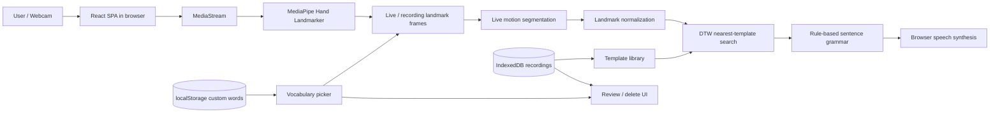

# Current-State Codebase Audit

| Field | Value |
|---|---|
| Product | ISL Interpreter browser prototype |
| Document status | Codebase baseline |
| Version | 1.0 |
| Baseline date | 2026-09-25 |
| Owner | Product + Engineering — assign before approval |
| Review scope | All first-party source, configuration, documentation, scripts, and evaluation artifacts |
| Excluded from source review | `node_modules/` internals and generated MediaPipe WASM glue implementation; their metadata and project integration were reviewed |

## 1. Evidence labels

- **[CODE]** — verified in first-party source or configuration.
- **[RUNTIME]** — observed while executing a local validation command on 2026-09-25.
- **[ARTIFACT]** — reported by a checked-in file but not independently reproduced because required data or tooling was unavailable.
- **[TARGET]** — proposed product requirement; not current behavior.
- **[OPEN]** — unresolved decision or evidence gap.

## 2. Executive assessment

The repository is a coherent, browser-only prototype for a fixed-vocabulary Indian Sign Language (ISL) interaction tool. It implements webcam hand tracking, up to two-hand landmark capture, template recording, browser-local persistence, motion-based segmentation, nearest-template recognition with Dynamic Time Warping (DTW), rule-based English sentence expansion, browser speech synthesis, recording review, import/export, and deletion.

It is **not ready for a general public release**. The most important blockers are:

1. A clean installation contains no bundled/approved recognition templates. The current product can only attempt calibration by recording or unsafe import, so it has no supported clean-install interpretation strategy.
2. Live segmentation is unvalidated, and the checked-in 97.535% result is not a reproducible held-out evaluation of the live path.
3. Core camera/model lifecycle and error handling can leak resources, hide failures, or trap recording in a non-terminating state.
4. Recording and import validation can corrupt the template library; a recording can be saved under a sign changed after capture.
5. The application makes remote model, font, and 3D-scene requests, so the current “nothing leaves your device” wording is too broad without qualification.
6. There are no first-party tests, CI, deployment configuration, supported-browser contract, or production templates.
7. Several README and page-title claims describe a different or earlier product state.

A controlled local demo may be possible after templates are created and camera/model behavior is manually verified. A credible public release requires the P0 remediation and release gates in this PRD set.

## 3. System inventory

### 3.1 First-party structure

| Area | Files / implementation |
|---|---|
| App shell | `src/main.jsx`, `src/App.jsx` |
| Pages | `src/pages/HomePage.jsx`, `InterpretPage.jsx`, `RecordPage.jsx`, `DeletePage.jsx` |
| Product components | `src/components/*.jsx` |
| Browser/media integration | `src/hooks/useHandLandmarker.js`, `src/lib/camera.js` |
| Recognition engine | `src/lib/segmentation.js`, `normalize.js`, `dtw.js`, `recognizer.js` |
| Language/output | `src/lib/vocabulary.js`, `customWords.js`, `sentenceGrammar.js` |
| Persistence | `src/lib/recordingStorage.js`, browser IndexedDB and localStorage |
| Evaluation | `scripts/evaluate.mjs`, `evaluation-results.json` |
| Visual/build tooling | Tailwind, PostCSS, GSAP, Spline, Vite, Oxlint |
| Public runtime assets | Favicon and three vendored MediaPipe WASM/JS variants |
| Backend/API | None |

### 3.2 Technology and direct dependencies

| Concern | Current implementation | Evidence |
|---|---|---|
| UI | React 19 + React DOM, JavaScript/JSX | `package.json`, `src/main.jsx` |
| Routing | React Router DOM with `BrowserRouter` | `package.json`, `src/main.jsx:3-11` |
| Build | Vite 8.1.0 | `package.json`, `vite.config.js` |
| Styling | Tailwind CSS 3.4.19 + arbitrary utilities/inline styles | `tailwind.config.js`, source JSX |
| Motion | GSAP 3.15.0 + `@gsap/react` | `package.json`, page components |
| 3D visuals | `@splinetool/react-spline` with three remote scenes | `src/components/SplineScene.jsx`, page components |
| Hand tracking | `@mediapipe/tasks-vision` Hand Landmarker | `src/hooks/useHandLandmarker.js` |
| Linting | Oxlint 1.71.0 | `package.json`, `.oxlintrc.json` |
| Persistence | Browser IndexedDB + localStorage | `src/lib/recordingStorage.js`, `src/lib/customWords.js` |
| Speech | Browser `SpeechSynthesisUtterance` | `src/components/LiveInterpreter.jsx:227-243` |
| Server | None | First-party source inventory |

### 3.3 Runtime dependencies and deployment assumptions

The application is currently root-host oriented:

- Client routes are `/`, `/interpret`, `/record`, and `/delete` (`src/App.jsx:18-24`).
- The MediaPipe WASM directory and favicon use absolute root paths (`src/hooks/useHandLandmarker.js:11-14`, `index.html:5`).
- A host must provide SPA fallback to `index.html` for direct navigation to client routes.
- Camera access requires HTTPS or localhost.
- Runtime requests depend on:
  - Google-hosted hand-landmarker `.task` model (`src/hooks/useHandLandmarker.js:4-14`); the MediaPipe WASM runtime itself is local.
  - Google Fonts (`index.html:8-13`).
  - Three Spline-hosted scene documents (`src/pages/HomePage.jsx:11`, `InterpretPage.jsx:11`, `RecordPage.jsx:12`).
- There is no service worker, PWA manifest, offline cache, or documented offline operating mode.

## 4. Current architecture and data flow

All recognition and persistence logic is client-side. No first-party API endpoint, account system, analytics SDK, or remote database was found.

## 5. Implemented capabilities

| Capability | Current behavior | Status / evidence |
|---|---|---|
| Landing page | Animated Spline hero, CTA, and three-step overview | Implemented; remote scene dependency (`src/pages/HomePage.jsx:167-274`) |
| Hand tracking | MediaPipe video mode, up to two hands, GPU attempt with CPU fallback | Implemented (`src/hooks/useHandLandmarker.js:28-34,82-120`) |
| Camera constraints | Ideal 640×480, ideal 30 FPS, minimum 15 FPS; no audio | Implemented (`src/lib/camera.js:9-17`) |
| Template recording | Three-second countdown, two-second capture, review, keep/discard | Implemented (`src/components/RecordingTool.jsx:21-24,194-304`) |
| Fixed vocabulary | 25 built-in signs; target is 15 repetitions per sign | Implemented; explicitly a hackathon vocabulary (`src/lib/vocabulary.js:1-54`) |
| Custom words | User-defined label mapped to an ASCII-slug sign ID | Implemented with collision and portability constraints (`src/lib/customWords.js:18-71`) |
| Recording persistence | IndexedDB database `isl-interpreter-recordings`, version 1 | Implemented (`src/lib/recordingStorage.js:13-29`) |
| Data transfer | JSON export/import of recording objects | Implemented; validation is incomplete (`src/lib/recordingStorage.js:142-218`) |
| Live segmentation | Motion/stillness detector with minimum/maximum segment rules | Implemented but unvalidated (`src/lib/segmentation.js:15-45`) |
| Recognition | Normalized landmark sequences compared with weighted DTW | Implemented (`src/lib/recognizer.js:50-140`, `src/lib/dtw.js`) |
| Sentence formation | Rule-based expansion of recognized sign IDs into English | Implemented (`src/lib/sentenceGrammar.js:1-18,61-157`) |
| Speech | Web Speech synthesis on hands-out timeout or manual action | Implemented without feature/error guard (`src/components/LiveInterpreter.jsx:178-243,408-414`) |
| Playback | Canvas-based skeleton animation with replay | Implemented (`src/components/SkeletonPlayback.jsx`) |
| Review/deletion | Search by known sign, replay, delete one, clear sign/all recordings | Implemented (`src/components/ReviewFlagged.jsx`, `RecordingTool.jsx`) |
| Camera diagnostics | Optional FPS, delegate, constraints, and adaptive-scale display | Implemented only in Camera Test (`src/components/HandTracker.jsx`) |
| 404 / route error handling | No catch-all route or React error boundary | Absent (`src/App.jsx:18-24`) |

## 6. Primary user journeys in the current product

### 6.1 First-time live interpretation

1. User starts on Home and follows the hero CTA to `/interpret`.
2. The live interpreter mounts immediately and begins model initialization, template loading, and camera permission handling before the user explicitly activates the tool.
3. With no local templates, the user is told to record signs first, but must use global navigation to reach `/record`.

Evidence: `src/pages/HomePage.jsx:207-225`, `src/components/LiveInterpreter.jsx:62-103,312-321`.

### 6.2 Record a sign template

1. User enters `/record`, selects a built-in or custom sign, and may enter recorder/batch metadata.
2. A three-second countdown starts a two-second capture.
3. The tool normalizes captured frames and plays the skeleton.
4. User replays, keeps, or discards the recording.

Evidence: `src/components/RecordingTool.jsx:194-304,384-592`.

### 6.3 Interpret and speak a sentence

1. Live frames are segmented into movement segments.
2. The final segment is normalized and classified against one-hand and two-hand template groups.
3. Accepted words append to a current sentence; immediate duplicate signs are suppressed.
4. The rule-based grammar previews the spoken sentence.
5. Removing both hands for 900 ms triggers synthesis; Speak Now also triggers it.

Evidence: `src/components/LiveInterpreter.jsx:101-243,349-427`.

### 6.4 Review and remove recordings

1. User searches for a known built-in or custom sign.
2. All matching skeleton cards auto-play.
3. User can replay or immediately delete an individual recording.

Bulk sign, custom-word, and global clear actions are located on the Record page.

Evidence: `src/components/ReviewFlagged.jsx:22-128`, `RecordingTool.jsx:499-592`.

## 7. Data inventory and trust boundaries

| Data class | Source | Current store / destination | Retention / deletion | Risk notes |
|---|---|---|---|---|
| Camera frames | Webcam MediaStream | Rendered in page; not intentionally persisted by first-party code | Ends with stream/page | No first-party upload was found; external asset requests still occur |
| Hand landmarks | MediaPipe | React memory, normalized templates, IndexedDB recordings | Recording deletion / clear actions | Sensitive biometric-like interaction data; no consent policy or retention contract |
| Recording metadata | User input / app | IndexedDB | Per-item and bulk deletion | Recorder label, batch, hand count, timestamp |
| Custom-word metadata | User input | localStorage | Individual word removal / browser storage clearing | Not included in recording exports; custom IDs can be orphaned or collide |
| Recognition templates | IndexedDB recordings | Browser memory during live classification | Derived from recordings | No bundled production dataset |
| Spoken text | Recognized sign IDs and grammar | Browser speech synthesis | Platform/browser dependent | Sentences clear immediately after synthesis is scheduled |
| Error/console data | Browser/runtime | Browser console | Browser-managed | No production monitoring or redaction policy |

### Storage model caveats

- Each IndexedDB operation opens a new database connection; connections are not explicitly closed.
- `getCountsPerSign` loads all recordings despite claiming to avoid full frame loading (`src/lib/recordingStorage.js:129-139`).
- No schema migration beyond database version 1 is implemented.
- Export includes recordings but not custom-word labels.
- Import checks only that `signId` is a string and `frames` is an array; it does not validate landmark shape, numeric finiteness, hand count, sequence length, file size, known sign, or duplicates (`src/lib/recordingStorage.js:162-187`).

## 8. Runtime validation evidence

Validation was run locally on 2026-09-25 in Windows. The evaluator error reported Node.js v24.14.1; the npm version was not recorded. The generated `dist/` directory was removed after measurement.

| Check | Result | Interpretation |
|---|---|---|
| `npm run build` | **Pass** | Vite 8.1.0 transformed 64 modules and produced a production build in 16.93 s. |
| Production asset size | **Warning** | 12 emitted asset files, 5,109,672 bytes raw. Largest: `react-spline` 2,035,974 bytes. Vite warned that multiple chunks exceed 500 kB. |
| `npx oxlint src scripts` | **Pass with warnings** | 5 warnings, 0 errors: one unused declaration, one unused import, and three React hook cleanup warnings. |
| `npm run lint` | **Fail** | 536 warnings and 3 errors because generated `public/wasm/*.js` glue is linted as first-party React code. The 3 errors are false-positive `useProgram` hook-name diagnostics in each generated file. |
| `node scripts/evaluate.mjs` | **Blocked** | Default input does not exist: `D:\mnt\user-data\uploads\isl-recordings-export-2026-07-23.json`. |
| Vite route responses | **Pass at HTTP level** | `/`, `/record`, `/interpret`, and `/delete` each returned HTTP 200 with the SPA root. This does not prove camera/UI functionality. |
| `npm audit --omit=dev --json` | **Fail** | Two high-severity dependency records for React Router 7.18.1 / transitive React Router, GHSA-qwww-vcr4-c8h2. The advisory concerns RSC mode; exploitability for this declarative SPA was not assessed. |
| Browser interaction audit | **Not run** | The desktop browser was unavailable, and automated camera permission would still require a controlled browser/device environment. |

### First-party lint findings

- Unused `FINGERTIP_INDICES` in `src/lib/dtw.js:17`.
- Unused `uniformWeight` import in `scripts/evaluate.mjs:9`.
- Effect cleanup ref warnings in `HandTracker.jsx:80`, `RecordingTool.jsx:184`, and `LiveInterpreter.jsx:217`.

The generated WASM directory should be excluded from first-party linting rather than suppressing hundreds of vendor diagnostics individually.

## 9. Evaluation evidence and limitations

### Checked-in artifact

`evaluation-results.json` reports:

- DTW band: `0.2`.
- k-nearest-neighbor value: `1`.
- Accuracy: `0.9753521126760564` (277/284).
- Suggested absolute threshold: approximately `0.36`.
- No examples with mixed hand counts.

The runtime defaults match the band and threshold in `src/lib/dtw.js:109-120` and `src/lib/recognizer.js:122-140`.

### What the evaluator does

`scripts/evaluate.mjs` performs leave-one-out comparisons within separate one-hand and two-hand groups, sweeps selected DTW bands and k values, and selects a threshold on the same data.

### What the result does not establish

- No held-out signer or condition split.
- No evaluation of live motion segmentation.
- No evaluation of the live classifier's deliberate cross-hand-count search.
- No fingertip-versus-uniform weighting comparison despite an unused `uniformWeight` import.
- No full-frame versus downsampling speed/accuracy benchmark.
- No latency, CPU, memory, browser, or device measurements.
- No precision, recall, false-accept rate, confidence calibration, or unknown-segment distribution.
- No dataset hash, signer/batch breakdown, collection protocol, or license/provenance manifest.
- No CI gate or regression threshold.

The evaluator is also not portable: its input defaults to a hard-coded external path and its output is written to a hard-coded POSIX path. It must accept repository-relative/configured paths and emit machine-readable evidence before its result can be treated as a release gate.

## 10. Critical defect and gap register

| ID | Severity | Finding | User / release impact | Required disposition |
|---|---|---|---|---|
| GAP-001 | P0 | No recognition templates ship with a clean install | New users cannot interpret | Bundle an approved template dataset or explicitly limit the product to personal calibration and provide an onboarding path |
| GAP-002 | P0 | Pending recording retains only frames/hand counts, while Keep reads the current sign and metadata and generates the save timestamp | A user can save a capture under another label/metadata or with an inaccurate capture time and corrupt recognition data | Snapshot vocabulary ID/label, expected hand count, and recorder/condition metadata at Start; bind capture start/end timestamps when capture begins/finishes; apply edits only to the next recording |
| GAP-003 | P0 | Camera/model async cleanup can leak streams or model instances | Privacy indicator/resource leak; StrictMode doubles the development exposure | Add cancellation after every await and explicit stream/model disposal |
| GAP-004 | P0 | Core flows hide model/camera failures; recording can enter “Recording…” forever | Users receive false idle status or cannot recover | Unify readiness/error state and add retry/cancel/watchdog behavior |
| GAP-005 | P0 | Import and recording validity checks are insufficient | Corrupt/unusable templates or runtime errors | Validate schema deeply, reject/quarantine invalid data, and add transactional rollback |
| GAP-006 | P0 | Custom IDs can collide with built-in vocabulary IDs | Data loss, wrong label selection, ambiguous deletion | Namespace custom IDs and enforce uniqueness across all vocabulary sources |
| GAP-007 | P0 | Custom labels are not preserved in exports or speech | Orphaned recordings and incorrect pronunciation/semantics | Store display labels in recording/export schema; pass labels to grammar/speech; resolve ambiguous sign semantics |
| GAP-008 | P0 | Live segmentation is unvalidated and assumes frame cadence in trimming | Core recognition can miss, split, or truncate signs | Build timestamp-based segmentation dataset and live end-to-end evaluation |
| GAP-009 | P1 | Full lint command fails on generated WASM glue | CI cannot provide a trustworthy signal | Exclude generated assets and enforce clean first-party lint |
| GAP-010 | P1 | No tests or CI | Regressions in stateful media/storage flows are undetectable | Add unit, integration, browser, fixture, and accessibility smoke tests |
| GAP-011 | P1 | React Router dependency advisory | Supply-chain/release hygiene risk | Upgrade to a fixed version and reassess; document advisory reachability |
| GAP-012 | P1 | Remote model, fonts, and scenes prevent reliable offline use | Setup and privacy claims fail without network; runtime failures | Bundle/localize assets with fallbacks or document and test online dependency precisely |
| GAP-013 | P1 | No deployment configuration or direct-route fallback documentation | Deep links/refresh can fail after release | Add host configuration, HTTPS, MIME, and SPA fallback requirements |
| GAP-014 | P1 | No supported browser/device matrix or validation of negotiated camera constraints | “Works” cannot be defined or tested even though ideal constraints are coded | Approve a matrix and test representative desktop/mobile devices and camera settings |
| GAP-015 | P1 | Accessibility barriers in forms, headings, live regions, motion, contrast, and canvas alternatives | Excludes users and creates unreliable communication | Implement the UX/accessibility PRD and WCAG-oriented release checks |
| GAP-016 | P1 | 3D/Spline payload remains heavy and mounted while camera tools run | Slower load, GPU/memory contention, fragile visual fallback | Route/asset split, offscreen unmount, static fallback, and performance budget |
| GAP-017 | P1 | Speech API is unfeatured and failures are silent | Sentence may clear without audible output | Detect support, handle errors, retain text/history until success, and expose replay |
| GAP-018 | P1 | Privacy/security/retention and consent documentation is absent | Users cannot understand or control data handling | Publish plain-language notices and enforce a browser-only data policy |
| GAP-019 | P1 | README, title, thresholds, timing, routes, and visual descriptions are stale | Misleading product claims and support burden | Reconcile all first-party documentation before release |
| GAP-020 | P2 | Recording counts/load all data and DB connections are repeatedly opened | Scaling and storage-efficiency risk | Optimize queries/connection lifecycle and add quota/corruption tests |
| GAP-021 | P2 | Review autoplays every matching skeleton at 30 FPS | Main-thread contention on larger result sets | One-active playback, pause controls, virtualization/lazy rendering |
| GAP-022 | P2 | No project license, notices, model/dataset provenance, or asset manifest | Legal and reproducibility uncertainty | Add dependency, model, dataset, and generated-asset provenance review |
| GAP-023 | P2 | No monitoring or privacy-safe diagnostics for production failures | Slow incident detection and weak feedback | Define local diagnostics first; add remote telemetry only after privacy approval |
| GAP-024 | P0 | IndexedDB CRUD resolves on request success rather than transaction completion | UI can report save/delete/clear success before a later transaction abort | Resolve/reject only on `transaction.oncomplete`/abort and test abort/quota behavior |
| GAP-025 | P0 | DTW assigns zero frame cost when one side has no hands and malformed/empty recordings are accepted | Dropout-heavy templates can obtain unrealistically favorable matches and poison classification | Filter/penalize invalid empty frames, validate recordings/imports, and test mixed frame states |
| GAP-026 | P0 | Displayed “confidence” is an uncalibrated distance transform; k=1 selects one template and runner-up may be the same class | Users may over-trust wrong output and one poor template can determine the result | Use class-level aggregation/margin, validate a score name, and report accepted precision/coverage/unknown behavior |

## 11. Claims requiring correction or qualification

| Current claim | Evidence-based correction |
|---|---|
| “Phase 1” in the document title | Replace with the actual product/release name (`index.html:7`). |
| Interpret is the default route | `/` renders Home (`src/App.jsx:20-23`). |
| Confidence 0.42 and DTW band 0.35 are best | Current runtime and stored artifact use threshold ~0.36 and band 0.2. |
| Speech occurs about 2.2 seconds after the last sign | Current hands-out trigger is 900 ms (`LiveInterpreter.jsx:31-32,178-194`). |
| “No wrong guesses get through silently” | Not established; acceptance uses an absolute distance-derived score without live calibration or runner-up margin. |
| Downsampling improved 297 ms to 50 ms and 96.1% to 96.8% | No benchmark artifact supports the comparison. |
| “Once loaded, the app no longer depends on internet” | Model, fonts, and Spline resources are remote; no service worker exists. |
| “Nothing leaves your device” | Qualify: first-party camera frames/landmarks are not intentionally uploaded, but the page contacts external asset hosts and uses platform speech synthesis. |
| “Developer tools hidden behind a collapsed toggle” | Record and Delete are ordinary global navigation links. |
| 97.5% accuracy as a release-quality claim | Label as a non-held-out pre-segmented leave-one-out artifact and do not use as a launch guarantee. |

## 12. Architecture strengths to preserve

- The on-device prototype boundary is simple and understandable.
- Browser-local storage enables rapid calibration without a backend.
- Recording includes replay before persistence, which can protect dataset quality when validation is strengthened.
- The hand-count grouping provides a useful metadata dimension for the recognizer.
- The implementation has a clear separation between camera tracking, segmentation, normalization, DTW, grammar, and UI components.
- The rule-based grammar is deterministic and easy to inspect compared with an opaque translation layer.
- A lockfile is present, enabling deterministic npm installation.

## 13. Release-readiness decision

**Current decision: not ready for general release.**

A minimum controlled demo requires:

1. A documented template-provisioning or personal-calibration flow.
2. Manual browser/camera/model verification on the supported-device matrix.
3. Explicit disclosure of online asset dependencies.
4. P0 data-integrity and lifecycle remediation.
5. A known-limitation statement that this is fixed-vocabulary, non-clinical, non-authoritative interpretation.

A public release additionally requires all P0 and P1 requirements, passing CI/release gates, approved quality thresholds, accessibility verification, privacy/security review, deployment support, and a reproducible evaluation baseline.

## 14. Audit limitations

- No git history, commit identifier, issue tracker, or approved product requirements were available.
- No connected browser was available for interactive desktop/mobile testing.
- Camera behavior depends on physical devices, browser permissions, WebGL/WASM support, and lighting/hand-size variation that cannot be validated from static source alone.
- The source evaluation dataset was absent, so recognition metrics were not rerun.
- Generated WASM implementation was treated as vendor code; only its packaging, size, lint interaction, and runtime integration were reviewed.
- All proposed targets and thresholds in the companion PRDs remain proposals until product, engineering, accessibility, privacy, and domain owners approve them.
